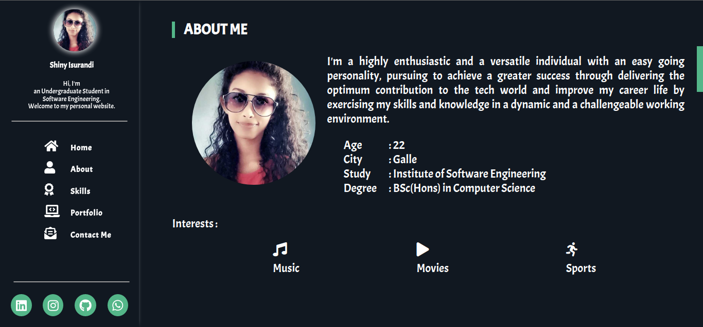

## **Hello 👋**

Welcome to my Personal Website...
 
This project elaborates my web development skills using HTML5 and CSS as a fresher.

## Objectives:
- To create a website by gathering the basic knowledge about website creation processes that aligns with an overarching strategy.
- To have an thorough knowledge about using HTML5 and CSS.

#

This website was an output of an overall process with the use of below strategies..
- Goal Identification
- Sitemap Creation
- Wireframe Creation
- Mock-up Creation

#

### **Links**

- [Site Map](https://www.gloomaps.com/mPrbHCxryr)
- [Wireframe](https://wireframe.cc/pro/pp/8d62350e0489025)
- [Mockup_v1](https://www.figma.com/file/81f53Vz4qRitBel5nKIWZp/MyWebsite?node-id=81%3A181)
- [Mockup_v2](https://www.figma.com/file/gdh3qndEQiwImjZfrD5MSY/MyWebsite_v2?node-id=0%3A1)
- [Mockup_v3](https://www.figma.com/file/cMGuXnq9jdreH3kcQLRVsh/MyWebsite_v3?node-id=0%3A1)
- [Mockup_v3 - Demo](https://www.figma.com/proto/cMGuXnq9jdreH3kcQLRVsh/MyWebsite_v3?node-id=81%3A181&scaling=scale-down&page-id=0%3A1&starting-point-node-id=81%3A181)
- [GitHub Pages URL for MyProfile](https://shinyzu.github.io/MyProfile/)
- [000WebHost URL](https://shiny1141.000webhostapp.com/)

 

  
  
  
  
  

